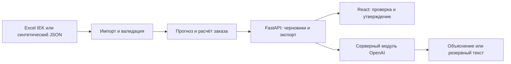

# Paralax — рекомендации по закупкам

Проект команды Paralax для кейса ТОО «Электрокомплект» на HackAlem AI. Сервис помогает менеджеру закупок превратить выгрузки продаж, остатков и товаров в пути в проверяемый черновик заказа поставщикам. Он показывает рекомендуемое количество и факторы расчёта; итоговое решение остаётся за менеджером.

> [!IMPORTANT]
> Это локальный прототип. Остаток IEK взят из среза на 01.09.2026, а сценарная дата расчёта — 22.09.2026. Перед реальной закупкой нужно подтвердить актуальный остаток, охват складов и сроки поставки.

## Что реализовано

- Импорт четырёх книг IEK с привязкой по строковому коду номенклатуры 1С, проверкой данных и аудитом исключённых позиций.
- Подготовка истории спроса с учётом крупных разовых документов, пропусков и периодов отсутствия товара. Для каждого SKU статистическая модель выбирается по проверке на прошлых периодах; затем Python-код рассчитывает количество на заданный горизонт.
- FastAPI для запуска расчёта, чтения черновика, ручной правки количества, утверждения, получения объяснения и экспорта CSV.
- Интерфейс React: обзор, поиск и фильтр рекомендаций, факторы по SKU, черновик по поставщикам и сведения об источниках. Доступны синтетический набор для быстрого демо и расчёт по локальным книгам IEK.
- Серверный модуль OpenAI для объяснения рассчитанных факторов с проверкой ответа и резервным текстом. Кнопка объяснения в интерфейсе подключена к этому модулю.

Рекомендуемое количество определяет расчётный код, а не языковая модель. Заказ поставщику автоматически не отправляется.

## Как работает решение

1. Менеджер выбирает синтетический набор или IEK и нажимает «Рассчитать».
2. Backend получает нормализованный JSON либо импортирует Excel. Данные проверяются по [контрактам](contracts/README.md); исходные таблицы не меняются.
3. Расчётный модуль оценивает спрос, запас, остаток и товар в пути и создаёт рекомендации с факторами, флагами качества и уровнем срочности.
4. Интерфейс показывает результат и группирует выбранные позиции по поставщикам. Менеджер может изменить количество, утвердить черновик и скачать CSV.

Подробные правила и контрольные примеры описаны в [методологии](docs/methodology.md). Полное ТЗ и границы MVP — в [спецификации](docs/spec.md).

## Технологии

- **Backend:** Python 3.11+, FastAPI, Uvicorn, pandas, NumPy, openpyxl, jsonschema.
- **Frontend:** React 19, TypeScript, Vite, lucide-react; типы результата генерируются из JSON Schema.
- **AI:** OpenAI Python SDK и Responses API; по умолчанию GPT-4.1 mini. Демо-ключ предоставлен владельцем проекта в корневом `.env`; backend загружает его при запуске.
- **Качество:** pytest, Ruff, mypy, ESLint, Prettier, TypeScript и сборка Vite.

## Архитектура



Основной код: [импортёр IEK](backend/importers/iek.py), [прогноз](backend/forecast.py), [расчёт](backend/planning.py), [HTTP API](backend/app.py), [AI-модуль](backend/ai.py) и [интерфейс](frontend/src/App.tsx). Состояние черновиков хранится в памяти backend.

## Установка и запуск

Нужны Python 3.11+ и Node.js с npm. Команды ниже приведены для PowerShell из корня клонированного репозитория.

```powershell
git clone https://github.com/BAITC-Hacks/hack-4341ec06-paralax.git
cd hack-4341ec06-paralax
python -m venv .venv
.\.venv\Scripts\python.exe -m pip install -e ".[dev]"
npm ci --prefix frontend
```

В первом терминале запустите API:

```powershell
.\.venv\Scripts\python.exe -m uvicorn backend.app:app --reload
```

Во втором терминале запустите интерфейс:

```powershell
npm run dev --prefix frontend
```

Откройте **http://127.0.0.1:5173**. Vite направляет запросы `/api` на локальный backend по адресу `http://127.0.0.1:8000`; описание API доступно на `http://127.0.0.1:8000/docs`. На Linux/macOS используйте `.venv/bin/python` вместо `.venv\Scripts\python.exe`. Дополнительные параметры интерфейса — в [frontend/README.md](frontend/README.md).

Проверки проекта:

```powershell
.\.venv\Scripts\python.exe scripts/check.py
```

Команда запускает Python-тесты, форматирование, линтер и типизацию, а также frontend-тест, проверки и сборку.

## Как проверить решение

**Быстрый сценарий без API-ключа и Excel:**

1. Откройте интерфейс, оставьте набор «Синтетический» и нажмите «Рассчитать». Это запускает действующий расчётный API на [синтетическом входе](fixtures/planning-input.sample.json), а не показывает готовую картинку.
2. Откройте «Рекомендации», выберите SKU, посмотрите факторы и предупреждения. Измените выбранное количество и сохраните.
3. Откройте «Черновик заказа», проверьте позиции по поставщикам, нажмите «Утвердить черновик» и «Скачать CSV». Поставщику ничего не отправится.

**Проверка IEK:** выберите «IEK · Excel» и запустите расчёт. Backend использует подготовленный локальный JSON, если он есть в `outputs/`, иначе импортирует четыре книги из `data/IEK/`. Первый расчёт может занять около минуты. Для воспроизводимого запуска через CLI:

```powershell
.\.venv\Scripts\python.exe -m backend.cli --data-dir data --output outputs/iek-planning-result.json --limit 50
```

CLI создаёт результат, нормализованный вход и аудит в `outputs/`. Описание входных файлов и допущений — в [карте данных](docs/data-map.md) и [инструкции расчёта](docs/prediction-run.md).

В синтетическом сценарии кнопка «AI-объяснение» вызывает OpenAI через backend с общим демо-ключом из `.env`. При ошибке API показывается резервное объяснение. Проверить пять платных запросов отдельно можно командой `.\.venv\Scripts\python.exe scripts/check.py --live-openai`; отчёт сохраняется в `outputs/`.

## Данные и интеграции

В `data/` лежат 12 переданных Excel-книг IEK и Systeme Electric. Текущий импортёр использует **четыре книги IEK**: месячные продажи, месячные остатки, документы продаж и товар в пути. Книги Systeme Electric, MOQ и агрегированная сезонность в этом расчёте не участвуют. Синтетические данные и проверочные сценарии находятся в [fixtures/](fixtures/scenarios.md).

Исходные Excel не отправляются в OpenAI API. Для синтетического набора сервис получает только рассчитанные факторы; для партнёрского IEK без разрешения на передачу агрегатов остаётся резервное объяснение. Без ключа расчёт и интерфейс работают. Демонстрационный `.env` включён в ветку `akzhan` по явному запросу владельца проекта; `data/private/`, `data/raw/` и производные результаты `outputs/` исключены из Git. Любой обладатель этого ключа может расходовать бюджет OpenAI-проекта.

## Ограничения текущей версии

- Демонстрационный импорт выбирает до 50 пригодных SKU IEK; эта выборка не представляет весь ассортимент. Адаптера Systeme Electric нет.
- Остаток не восстановлен с 01.09.2026 до сценарной даты 22.09.2026. Охват складов не подтверждён. Срок поставки 14 дней, период пересмотра 14 дней и страховой запас 7 дней — параметры сценария, а не сведения поставщика.
- ID клиентов и цены в используемых таблицах отсутствуют. Поэтому крупный документ нельзя достоверно назвать заказом одного клиента, а финансовую стоимость заказа нельзя рассчитать.
- Для IEK HTTP-объяснение остаётся резервным до разрешения на передачу агрегированных данных. Черновики хранятся только в памяти сервера и исчезают после его перезапуска.
- Интеграция с 1С и автоматическая отправка заказа поставщику не реализованы. Выгрузка CSV и утверждение остаются локальным решением менеджера.

## Развёрнутая версия и материалы

Ссылка на развёрнутую версию в репозитории не указана; решение запускается локально по инструкции выше.

- [Спецификация MVP](docs/spec.md) · [фактический план команды](docs/tasks.md) · [контракт API](contracts/api.md)
- [Методология и ограничения точности](docs/methodology.md) · [запуск расчётной части](docs/prediction-run.md)
- [Исходное подробное описание кейса и планы](docs/case-brief-original.md) — сохранены для контекста; актуальные функции и команды приведены на этой странице.
