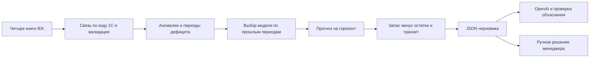

# Методология прогноза спроса и расчёта заказа

Расчётная часть Paralax преобразует четыре Excel-книги IEK в проверяемый JSON-черновик пополнения. Для каждого SKU выбирается статистическая модель, оценивается спрос на будущий горизонт и рассчитывается количество заказа. OpenAI объясняет полученный результат; числовой расчёт выполняется Python-кодом.

Документ описывает реализацию на коммите `8127534`, проверенную 23.09.2026. Правила и ограничения ниже относятся к этой версии.

**Навигация:** [данные](#1-входные-данные) · [очистка](#2-подготовка-истории) · [модели](#3-прогноз-и-выбор-модели) · [заказ](#4-расчёт-заказа) · [JSON](#5-результат-и-объяснение) · [качество](#6-проверка-качества) · [запуск](#7-воспроизведение).

> [!IMPORTANT]
> Остаток из книги относится к 01.09.2026, а дата сценарного расчёта — 22.09.2026. Без журнала поступлений актуальный остаток не восстановлен. Результат требует проверки менеджером перед закупкой.



## 1. Входные данные

Связь между источниками — строковый код номенклатуры 1С. Название товара не является ключом. Импортёр сохраняет завершающие символы кода, единицу измерения, источники и даты срезов.

| Книга в `data/IEK/` | Что берём | Для чего |
| --- | --- | --- |
| `Ежемесячные продажи в количественном выражении за последние 2 года.xlsx` | Количество по SKU и месяцу | Основной временной ряд: январь 2024 — август 2026 |
| `Ежемесячные остатки продукции за последние 2 года  ИЭК.xlsx` | Начальные месячные остатки, единица | Остаток 01.09.2026 и признаки возможного дефицита |
| `Динамика продаж_2025-2026.xlsx` | Дата, документ, SKU, склад, количество | Поиск крупных документов и сверка с месячными продажами |
| `Путь ИЭК 22.09.2026.xlsx` | Количество и ожидаемые даты поступления | Учёт уже заказанного товара внутри горизонта |

Незавершённый сентябрь продаж исключается. Документные продажи не прибавляются к месячным повторно. Отсутствующие ID клиентов и цены не выдумываются. Поэтому аномалия означает **крупный документ**, а не доказанный заказ одного клиента.

Для демо отбираются первые 50 пригодных SKU в сортировке по коду: единица «шт», не менее 24 известных месячных значений, известные последние шесть месяцев, связанный остаток и транзит, непротиворечивые документы. Это отбор для демонстрации, не репрезентативная выборка всего ассортимента.

MOQ-книга не используется: смысл «мин.кол. в упак.» не подтверждён. Книга сезонности содержит агрегированную выручку, поэтому количественная сезонность строится по истории SKU. Адаптер Systeme Electric в эту реализацию не входит.

Подробные колонки, исключения и источники: [карта данных](data-map.md), [импортёр](../backend/importers/iek.py).

## 2. Подготовка истории

### Валидация и пропуски

- JSON проверяется по схеме и межтабличным связям; запрещены некорректные даты, отрицательные остатки, нечисловые значения и дубли ключей.
- Пустые месячные значения остаются `null`: неизвестное значение не превращается в нулевой спрос.
- Неоднозначные SKU с дублями транзита, пустыми количествами документов или несовместимыми единицами исключаются с записью в аудит.
- Отрицательные документные корректировки сохраняются в аудите; они не превращаются в положительные продажи через модуль числа.
- Пустая ячейка существующей строки транзита трактуется как отсутствие заказа по этой колонке. Это явное допущение импортёра.

Аудит содержит выбранные SKU, исключения и SHA-256 использованных книг. Исходные Excel не изменяются. Контракты: [вход](../contracts/planning-input.schema.json), [выход](../contracts/planning-result.schema.json).

### Разовая крупная продажа

Для документа вычисляется медиана объёмов предшествующих документов того же SKU за последние 30 дней. Нужно минимум три предшествующих документа; документы текущего дня в опорную историю не входят.

```text
кандидат аномалии: объём документа > 5 × медиана
превышение = объём документа − медиана
```

Исходная продажа сохраняется. Превышение вычитается из месячного количества только при совпадении суммы документов с месячной продажей. Если суммы расходятся, остаются флаг и предупреждение, корректировка не применяется. Выходное `anomaly_excess_quantity` содержит именно применённое ограничение.

Порог 5 — фиксированное правило MVP, не обученный классификатор и не доказательство неповторяемости покупки.

### Дефицит товара — stockout

Месячное количество переводится в среднюю дневную интенсивность. Это среднее по экспозиции, а не восстановленная последовательность ежедневных продаж.

| Ситуация | Обработка |
| --- | --- |
| Дефицит не подтверждён | Количество делится на календарные дни месяца |
| Подтверждён дефицит части месяца | Делим на дни наличия; оценка упущенного спроса равна дневной интенсивности × дни дефицита |
| Подтверждён весь месяц, продаж 0 | В обучении остаётся `null`; упущенный спрос оценивается по наблюдаемой предыстории |
| Весь месяц дефицита, но положительные продажи | Ошибка противоречивого входа |
| Начальный остаток 0 | Флаг `suspected_stockout`; точные дни отсутствия не устанавливаются |
| Начальный остаток 0 и продажи 0 | Спрос неизвестен, вместо нуля используется `null` |

Для полного подтверждённого месяца берётся средняя дневная интенсивность того же календарного месяца прошлых лет. Если таких наблюдений нет — среднее последних шести доступных предшествующих месяцев. Оценка умножается на календарные дни дефицита. Последующие наблюдения и восстановленные значения не используются. Если предыстории нет, поле оценки остаётся 0 с предупреждением: это отсутствие оценки, а не доказанное отсутствие потерь. Пропущенное месячное количество остаётся неизвестным и не восстанавливается этим правилом.

Пересекающиеся интервалы считаются по объединению дней. `estimated_lost_demand` — суммарная историческая оценка, **она не добавляется повторно к будущему заказу**. Влияние дефицита на прогноз уже учитывается через подготовленную историю.

Реализация: [history и lost_month](../backend/planning.py).

## 3. Прогноз и выбор модели

Для каждого SKU модели прогнозируют количество в день по месячным наблюдениям. Недоступные значения пропускаются. Базовое значение `b` — среднее последних шести известных дневных интенсивностей, либо всех известных, если их меньше шести.

| Модель | Правило | Ограничения |
| --- | --- | --- |
| `mean6` | Прогноз равен `b` | Простая базовая модель |
| `ses` | Экспоненциальное сглаживание: `level = 0.3 × value + 0.7 × level` | Начальный уровень — первое известное значение |
| `trend` | Продление устойчивого изменения последних шести месяцев | Все шесть известны; минимум 4 из 5 изменений имеют один знак |
| `seasonal` | Среднее известных дневных интенсивностей соответствующего календарного месяца | Для доступности кандидата нужно минимум два наблюдения каждого из 12 месяцев |
| `tsb` | Вероятность ненулевого спроса × сглаженный размер ненулевого спроса | Полная история от шести месяцев, минимум 30% явных нулей; оба коэффициента сглаживания 0.2 |

Для `trend` наклон равен `(последнее − первое) / 5`. Он продлевается максимум на три месячных шага; результат ограничивается диапазоном `[0.5 × b, 1.5 × b]`. Без устойчивого направления модель возвращает `b`. Поэтому отдельный скачок не считается устойчивым трендом.

При выборе модели используется **временная валидация с расширяющимся окном**:

1. Выбираются известные точки среди последних шести календарных позиций, перед каждой должно быть минимум шесть позиций истории.
2. Каждая модель предсказывает точку только по предшествующей истории.
3. Сравнивается MAE — средняя абсолютная ошибка, единиц в день, на одинаковых точках для допущенных кандидатов.
4. Выбирается минимальная ошибка. При равенстве приоритет: `mean6`, `ses`, `trend`, `seasonal`, `tsb`.
5. Выбранная модель использует всю доступную историю для будущего прогноза.

На внутренних срезах сезонному кандидату достаточно одного прошлого наблюдения каждого календарного месяца; условие двух наблюдений относится к доступности кандидата на всей рассматриваемой истории. Если оценить кандидатов невозможно, используется сезонная гипотеза при достаточных данных, иначе `mean6`; в JSON выводится предупреждение и `validation_mae: null`.

Модели являются альтернативами. Сезонная и трендовая модели не складываются. Выходные `seasonality_multiplier` и `trend_multiplier` описывают отношение прогноза к базовому уровню. `trend_multiplier` для SES/TSB тоже может отличаться от 1 — это изменение уровня, не отдельное доказательство тренда. Внешний рост применяется отдельно.

Реализация: [forecast.py](../backend/forecast.py). Обоснование выбора подхода и официальные источники: [prediction-design.md](prediction-design.md).

## 4. Расчёт заказа

Обозначения: `L` — срок поставки, `R` — период пересмотра, `S` — дни страхового запаса, `g` — внешний рост в процентах, `I` — остаток, `T` — допустимый транзит.

```text
H = L + R
F = сумма прогнозных дневных интенсивностей на H дней × (1 + g / 100)
B = (F / H) × S
Q = max(0, ceil(F + B − I − T))
```

Горизонт начинается на следующий день после `as_of_date` и заканчивается через `H` дней включительно. Если он пересекает границу месяцев, используется прогноз соответствующего месяца для каждого дня.

По умолчанию в демо `L=14`, `R=14`, `S=7`, `g=0`. Это редактируемые сценарные параметры, не подтверждённые условия IEK. Страховой запас фиксирован в днях; целевой уровень сервиса или доверительный интервал пока не оцениваются.

**Транзит.** При наличии ETA исключается количество с поступлением позже конца горизонта. Просроченный транзит пока учитывается с предупреждением. Без ETA принято поступление внутри горизонта, также с предупреждением. Точная симуляция ежедневного баланса и риска задержек не реализована.

**Округление.** В коде перед `ceil` вычитается `1e-9` для защиты от погрешности чисел с плавающей точкой. Если `Q>0` и заданы подтверждённые параметры `minimum_order_quantity` и `order_multiple`, применяется:

```text
Q_final = ceil(max(Q, minimum_order_quantity) / order_multiple) × order_multiple
```

При нулевой потребности MOQ не создаёт заказ. Без заданных ограничений кратность равна 1, минимальная партия — 0.

**Срочность** проверяется последовательно: `critical`, если остаток 0 и спрос положительный; `high`, если остатка в днях спроса меньше срока поставки; `medium`, если остаётся положительный заказ; иначе `low`. Это эвристика, не вероятность дефицита; срочность не учитывает календарь отдельных поступлений.

### Контрольный пример

При прогнозе 1 шт./день, горизонте 28 дней, запасе 7 дней, остатке 5 шт. и транзите 3 шт.:

```text
F = 28; B = 7; Q = ceil(28 + 7 − 5 − 3) = 27 шт.
```

При полном декабрьском дефиците и прошлой интенсивности 2 шт./день историческая оценка потерь составляет 62 шт. При будущем горизонте 28, запасе 7 дней, остатке 0 и транзите 10 заказ равен `56 + 14 − 10 = 60`, а не 122: исторические потери второй раз не добавляются.

## 5. Результат и объяснение

`plan(input)` возвращает валидный `PlanningResult` со статусом `draft`. В каждой рекомендации:

| Поля | Смысл |
| --- | --- |
| `recommended_quantity`, `selected_quantity` | Расчётное количество и отдельный выбор менеджера; изначально совпадают |
| `factors` | Спрос, горизонт, запас, остаток, транзит и поправки |
| `flags`, `reason` | Признаки аномалий/неопределённости и арифметическое обоснование |
| `diagnostics` | Выбранная модель, MAE кандидатов, число точек проверки, единица и предупреждения |
| `source_files`, `assumptions` на уровне результата | Использованные источники и допущения |

Функции ручного выбора и утверждения находятся в [workflow.py](../backend/workflow.py). Расчёт не отправляет заказ поставщику.

### Роль OpenAI

В [ai.py](../backend/ai.py) настроен `gpt-4.1-mini-2025-04-14`; модель переопределяется `OPENAI_MODEL`. Backend вызывает Responses API с JSON Schema, `store=False`, таймаутом 20 секунд и без автоматических повторов.

Модель получает проверенные числовые факторы, обезличенный `item-1`, единицу, флаги и дату остатка. Возвращает 2–5 ключей факторов и допустимые коды риска/вопроса. Backend проверяет ответ, добавляет обязательные компоненты формулы и применённые поправки, формирует текст из словаря и чисел. Предупреждения берутся из расчёта. Итоговый список факторов может содержать больше пяти ключей.

Свободный текст GPT не становится источником чисел. При ошибке, отказе или неподходящем JSON возвращается шаблонное объяснение с `fallback: true`; расчёт сохраняется. Партнёрские данные по умолчанию во внешний API не передаются. Проверка с ключом пользователя выполняется на синтетических сценариях.

## 6. Проверка качества

Следует различать три проверки:

| Проверка | Что доказывает | Результат на 23.09.2026 |
| --- | --- | --- |
| Автоматические тесты и `check` | Формулы, контракты, обработку ошибок и сборку | 50 Python-тестов и общие проверки прошли |
| Пять реальных API-сценариев | Подключение OpenAI и корректность объяснений | 5/5 без fallback после исправлений |
| Отложенные продажи IEK | Ошибку прогноза на неиспользованных при выборе модели месяцах | 50 SKU × 3 месяца = 150 точек |

В отложенной проверке июнь–август 2026 исключены из обучения. Модель выбирается только по более ранней истории; все три месяца прогнозируются из одной точки без дообучения на фактических продажах этих месяцев. Сравнение проводится с `mean6` на наблюдаемых месячных продажах.

```text
WAPE = сумма |факт − прогноз| / сумма фактических продаж
MAE = среднее |факт − прогноз|
```

| Метод | WAPE | MAE, шт./месяц |
| --- | ---: | ---: |
| Автоматический выбор кандидата | 33.67% | 354.30 |
| Среднее последних шести наблюдений | 32.90% | 346.14 |

**Преимущество автоматического выбора не подтверждено.** WAPE не является вероятностью правильного ответа. Выборка исключает многие неоднозначные и редкие SKU; три месяца не характеризуют весь сезонный цикл. Продажи при дефиците не равны скрытому спросу. Финальный производственный выбор использует более позднюю историю, чем этот эксперимент.

Предыдущий эксперимент из 20 запросов выявил две арифметические ошибки при прямом расчёте заказа GPT. Это дополнительное основание сохранять воспроизводимый расчёт количества в коде. Полные условия и ответы: [отчёт эксперимента](openai-benchmark-20260923.md). Реализация оценки: [evaluation.py](../backend/evaluation.py).

## 7. Воспроизведение

Команды выполняются из корня ветки `akzhan`, Python 3.11+; установка зависимостей и настройка окружения описаны в [инструкции запуска](prediction-run.md).

```powershell
# Четыре Excel → входной JSON, аудит и результат на 50 SKU
.venv\Scripts\python -m backend.cli --data-dir data --output outputs/iek-planning-result.json --limit 50

# Отложенная оценка против mean6
.venv\Scripts\python -m backend.evaluation --input outputs/iek-planning-result.input.json --output outputs/iek-evaluation.json

# Общие проверки и пять реальных запросов с локальным API-ключом
.venv\Scripts\python scripts/check.py --live-openai
```

Ключ `OPENAI_API_KEY` хранится в локальном `.env`; переменные процесса имеют приоритет. Ключ не включается в Git. API-проверка платная; любой fallback означает неуспешную проверку. Для CI без ключа используется `scripts/check.py` без флага.

Результаты и производные данные сохраняются в игнорируемой папке `outputs/`. Файлы `.input.json`, `.audit.json`, `iek-evaluation.json` и `mvp-live-check.json` позволяют проверить вход, исключения, метрики и API-ответы.

## 8. Границы применения

Для реального закупочного решения нужны актуальный остаток и подтверждённый складской охват, сроки поставки, смысл MOQ/кратности и история наличия товара. Пока не реализованы интервалы прогноза, подбор страхового запаса под уровень сервиса, экономика дефицита/хранения, ограничения бюджета и мощности поставщика. Категория присутствует в результате, но отдельная модель категории не обучается.

Следующая аналитическая проверка должна расширить временные срезы и состав SKU, сохранив отдельную отложенную выборку. Улучшение модели можно заявлять только после сравнения с базовым методом на этих данных. Текущая версия даёт проверяемый сценарный черновик с явными допущениями.
